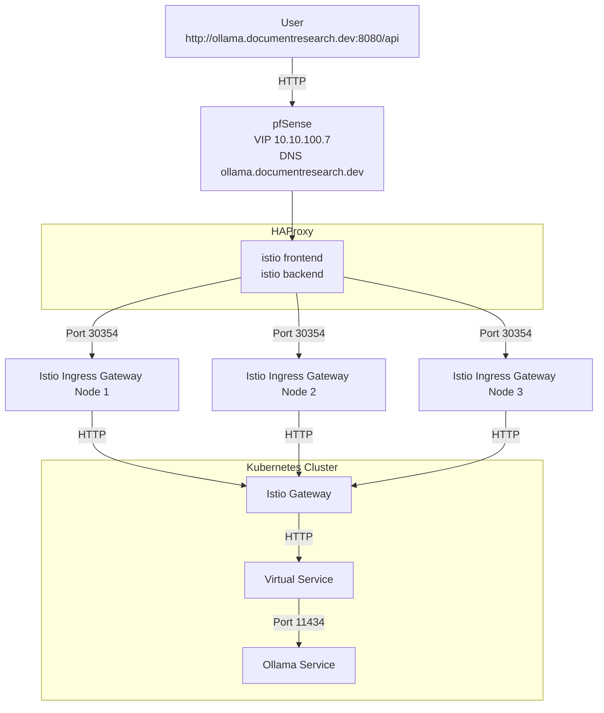

```mermaid
graph TD
    User[User\nhttp://ollama.documentresearch.dev:8080/api] -->|HTTP| PF[pfSense\nVIP 10.10.100.7\nDNS ollama.documentresearch.dev]
    PF --> HAP
    
    subgraph HAProxy
    HAP[istio frontend\nistio backend]
    end
    
    HAP -->|Port 30354| IS1[Istio Ingress Gateway Node 1]
    HAP -->|Port 30354| IS2[Istio Ingress Gateway Node 2]
    HAP -->|Port 30354| IS3[Istio Ingress Gateway Node 3]
    IS1 & IS2 & IS3 -->|HTTP| IG[Istio Gateway]
    IG -->|HTTP| VS[Virtual Service]
    VS -->|Port 11434| OL[Ollama Service]
    
    subgraph Kubernetes Cluster
    IG
    VS
    OL
    end
```
