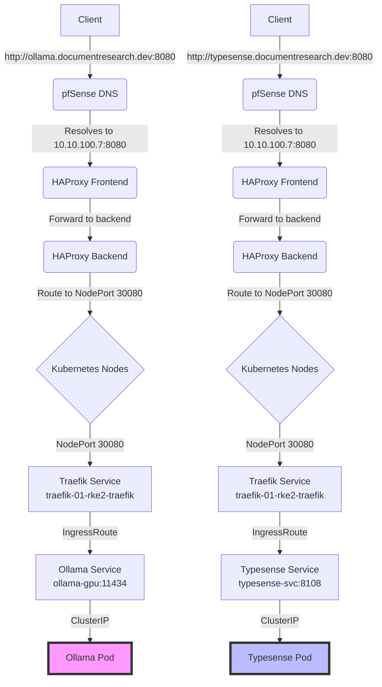

```mermaid
    graph TD
        A[Client] -->|http://ollama.documentresearch.dev:8080| B(pfSense DNS)
        B -->|Resolves to 10.10.100.7:8080| C(HAProxy Frontend)
        C -->|Forward to backend| D(HAProxy Backend)
        D -->|Route to NodePort 30080| E{Kubernetes Nodes}
        E -->|NodePort 30080| F[Traefik Service<br>traefik-01-rke2-traefik]
        F -->|IngressRoute| G[Ollama Service<br>ollama-gpu:11434]
        G -->|ClusterIP| H[Ollama Pod]

        I[Client] -->|http://typesense.documentresearch.dev:8080| J(pfSense DNS)
        J -->|Resolves to 10.10.100.7:8080| K(HAProxy Frontend)
        K -->|Forward to backend| L(HAProxy Backend)
        L -->|Route to NodePort 30080| M{Kubernetes Nodes}
        M -->|NodePort 30080| N[Traefik Service<br>traefik-01-rke2-traefik]
        N -->|IngressRoute| O[Typesense Service<br>typesense-svc:8108]
        O -->|ClusterIP| P[Typesense Pod]

        style H fill:#f9f,stroke:#333,stroke-width:4px
        style P fill:#bbf,stroke:#333,stroke-width:4px
```