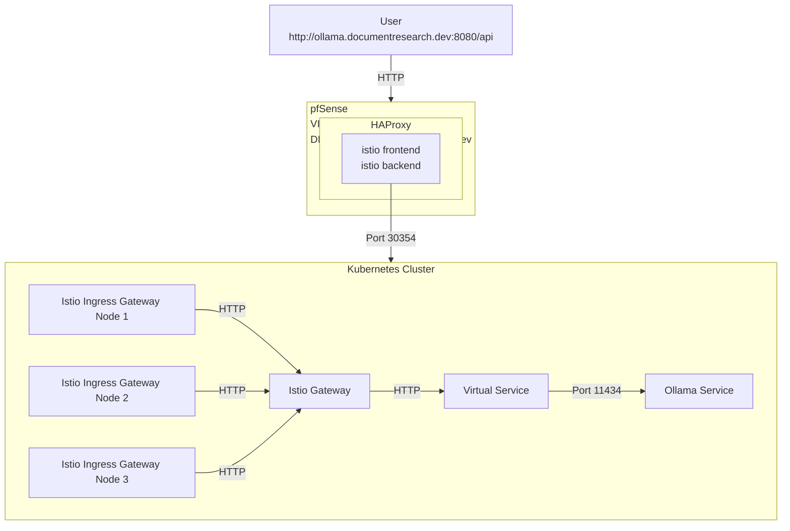

```mermaid
graph TD
    User[User\nhttp://ollama.documentresearch.dev:8080/api] -->|HTTP| PF

    subgraph PF[                     pfSense                     \nVIP 10.10.100.7\n DNS ollama.documentresearch.dev]
        subgraph HAProxy
        HAP[istio frontend\nistio backend]
        end
    end

    HAP -->|Port 30354| KC

    subgraph KC[Kubernetes Cluster]
        IS1[Istio Ingress Gateway Node 1]
        IS2[Istio Ingress Gateway Node 2]
        IS3[Istio Ingress Gateway Node 3]
        IG[Istio Gateway]
        VS[Virtual Service]
        OL[Ollama Service]
        
        IS1 & IS2 & IS3 -->|HTTP| IG
        IG -->|HTTP| VS
        VS -->|Port 11434| OL
    end
```
