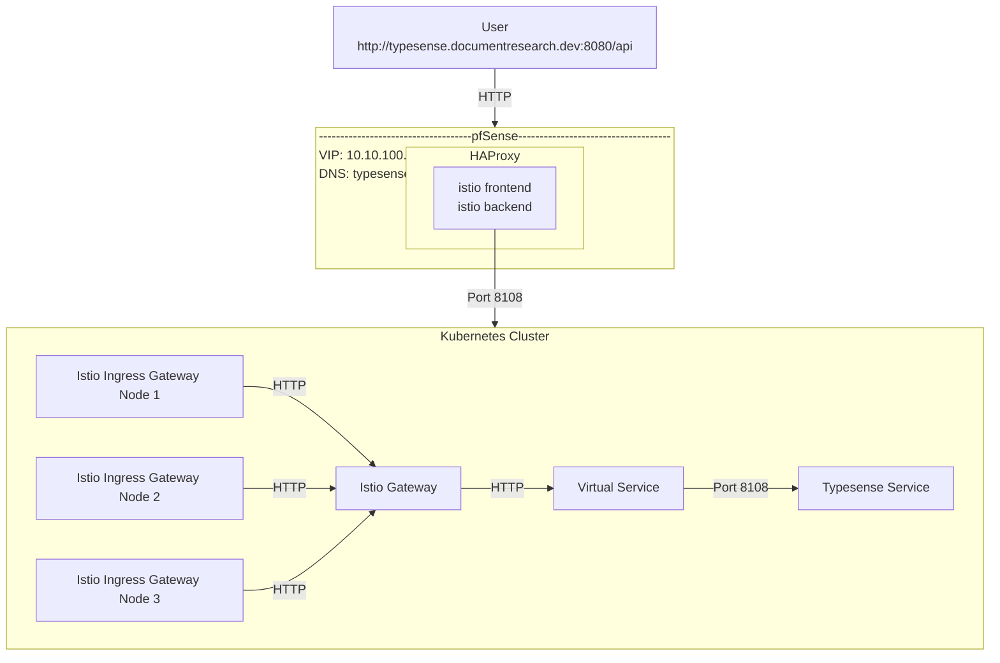

```mermaid
graph TD
    User[User\nhttp://typesense.documentresearch.dev:8080/api] -->|HTTP| PF

    subgraph PF[------------------------------------pfSense------------------------------------\nVIP: 10.10.100.7\n DNS: typesense]
        subgraph HAProxy
        HAP[istio frontend\nistio backend]
        end
    end

    HAP -->|Port 8108| KC

    subgraph KC[Kubernetes Cluster]
        IS1[Istio Ingress Gateway Node 1]
        IS2[Istio Ingress Gateway Node 2]
        IS3[Istio Ingress Gateway Node 3]
        IG[Istio Gateway]
        VS[Virtual Service]
        TS[Typesense Service]
        
        IS1 & IS2 & IS3 -->|HTTP| IG
        IG -->|HTTP| VS
        VS -->|Port 8108| TS
    end
```
